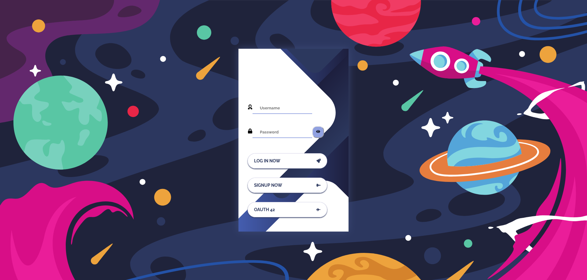
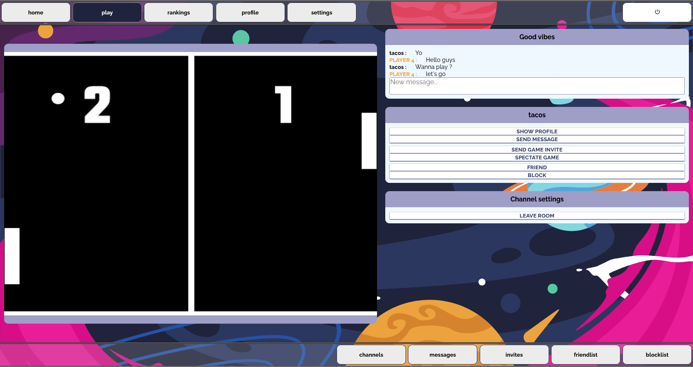
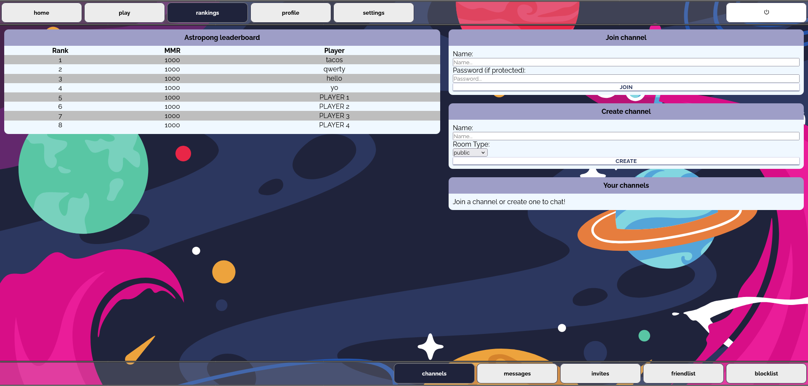

[![React][React.js]][React-url] [![Nest][Nest.js]][Nest-url] [![postgresql][postgresql]][postgresql-url]

# 42-Transcendence

A modern twist on the classic Pong game built for educational purposes at 42. This project brings together a robust tech stack to deliver a dynamic Pong experience with two distinct modes: a classic mode inspired by the original 1972 version and a boosted mode where enhanced physics give the ball extra velocity based on paddle movement.

## Table of Contents

- [Features](#features)
- [Tech Stack](#tech-stack)
- [Screenshots](#screenshots)
- [Installation](#installation)
- [Usage](#usage)
- [API & Integrations](#api--integrations)
- [Contributing](#contributing)
- [License](#license)

## Features

- **Dual Game Modes:**
  - **Classic Mode:** A modern reimagining of the traditional Pong.
  - **Boosted Mode:** Enhanced gameplay where the ball’s speed increases and gains momentum from paddle movement.
- **Modern UI:** Developed using [Phaser](https://phaser.io/) for smooth animations and improved graphics.
- **Robust Backend:** Built with NestJS, featuring a Swagger-documented API.
- **Containerized Setup:** Easy deployment using Docker and docker-compose.
- **Leaderboard:** Displays top scores in real time.
- **Realtime Chat:** Enables live interaction between players.
- **Profile Page:** User profiles to manage personal information and stats.
- **Multi-Factor Authentication (MFA):** Secure login with MFA support.
- **Matchmaking:** Automatically pairs players for games through a matchmaking system.

## Tech Stack

- **Frontend:** React (with TypeScript) built using Create React App.
- **Game Engine:** Phaser.
- **Backend:** NestJS (TypeScript) with Swagger API documentation.
- **Database:** PostgreSQL managed with Prisma.
- **Containerization:** Docker (orchestrated via docker-compose).

## Screenshots

<p align="center">
  
  
  
</p>

For more screenshots, check out the [screenshots folder](./screenshots/).

## Installation

Follow these steps to set up the project locally using Docker:

1. **Clone the Repository**
   ```bash
   git clone https://github.com/acharlas/42-transcendence.git
   cd 42-transcendence
   ```
2. **Configure Environment Variables**

   The project uses environment variables for both the frontend and backend. Update the templates with your own values where necessary.

   **Warning**: The project is fully functional without the 42 API or Twilio API keys. You can leave these as placeholders if you're not a 42 student or don't require Twilio integration.

   - **Frontend (.env):** Located at `front/react/.env`

     ```env
     REACT_APP_42API_REDIRECT='http://localhost:3001/42-redirect'
     REACT_APP_42API_UID='REPLACE'
     ```

   - **Backend (.env):** Located at `back/nest/.env`

     ```env
     DATABASE_URL='postgresql://postgres:postgres@db:5432/postgres?schema=public'
     JWT_SECRET='REPLACE'

     42API_REDIRECT='http://localhost:3001/42-redirect'
     42API_UID='REPLACE'
     42API_SECRET='REPLACE'

     TWILIO_ACCOUNT_SID='REPLACE'
     TWILIO_AUTH_TOKEN='REPLACE'
     TWILIO_SERVICE_SID='REPLACE'
     ```

   **Note:** Do not expose or share your actual API keys. These placeholders ensure that only authorized 42 students can input their own keys.

3. **Run the Project**
   Use Docker Compose to build and start all services:
   ```bash
   docker-compose up --build
   ```

## Usage

- **Frontend:**  
  Once the containers are running, access the React app at [http://localhost:3001](http://localhost:3001).

- **Backend API:**  
  The NestJS API (with Swagger documentation) is available at [http://localhost:3333/docs](http://localhost:3333/docs).

- **Database:**  
  The PostgreSQL database is exposed on port 5432 (with a test database on port 5433).

## API & Integrations

- **42 API Integration:**  
  The project uses the 42 API for authentication and user management. Remember, only 42 students should configure and use these credentials.
- **Twilio Integration:**  
  Twilio is used for SMS notifications. Replace the placeholder credentials with your own if you are authorized.

## Contributing

This project is shared publicly for educational purposes. Contributions are welcome as long as they align with the project’s goals. If you wish to contribute improvements or fixes, please open an issue or submit a pull request.

## License

This project is open source and provided for educational use only. Sensitive API keys and credentials are not included. Use the project responsibly in accordance with the guidelines provided by 42.

[React.js]: https://shields.io/badge/react-black?logo=react&style=for-the-badge
[React-url]: https://react.dev/
[Nest.js]: https://img.shields.io/badge/nestjs-E0234E?style=for-the-badge&logo=nestjs&logoColor=white
[Nest-url]: https://nestjs.com/
[postgresql]: https://img.shields.io/badge/postgresql-4169e1?style=for-the-badge&logo=postgresql&logoColor=white
[postgresql-url]: https://www.postgresql.org/
